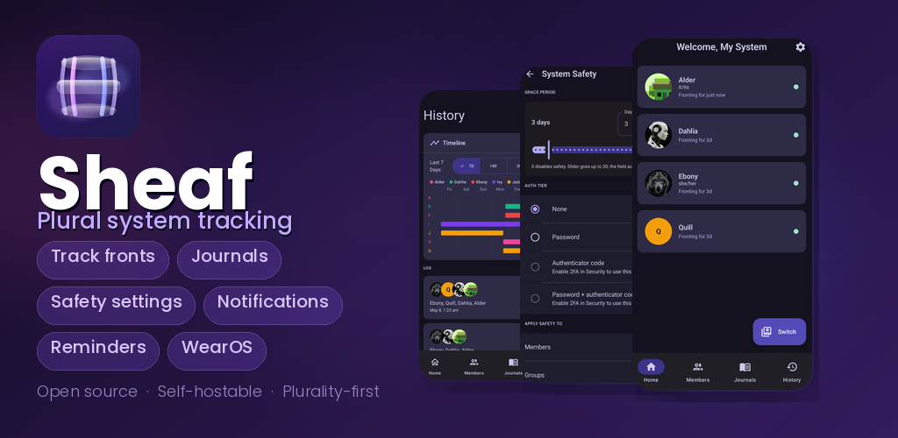

Sheaf is an open-source plural system tracker designed with scalability, sustainability, and selfhostability in mind.

### Features
* Built by plural systems, for plural systems
* Web, iOS, Apple Watch, Android, and WearOS support
* Track member profiles, fronting status, journals
* Polls, in-system messaging
* Front change notifications and reminders
* Safety and audit logging settings
* Import system data from Simply Plural, PluralKit, and more coming soon
* Sensitive member and system data encrypted at-rest
* AGPL licensed; Designed for selfhosting or as a hosted instance
* API-first design, scoped API permissions, full custom client support

